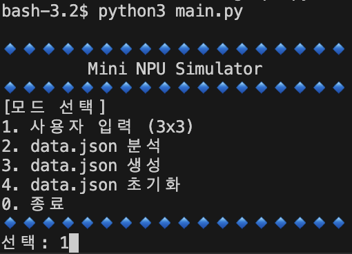
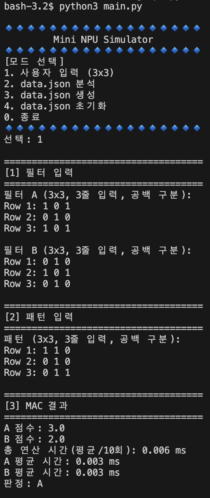
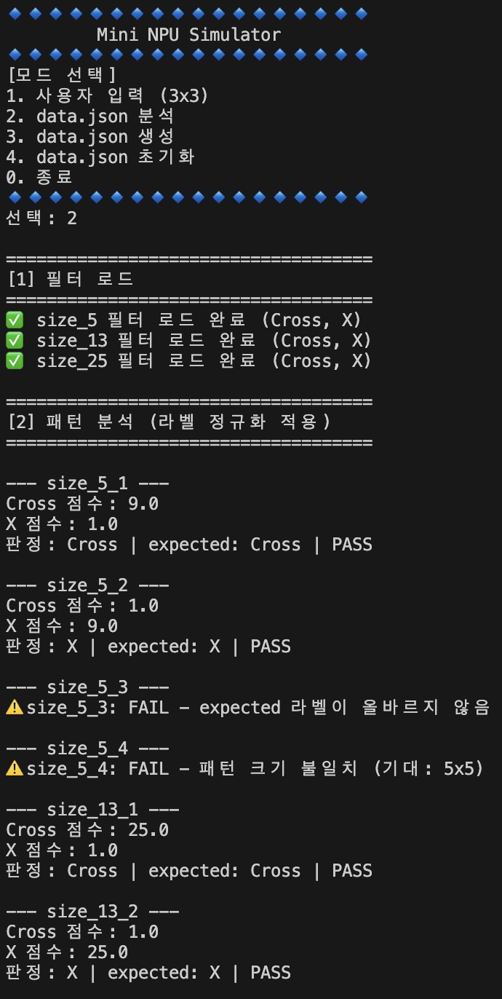
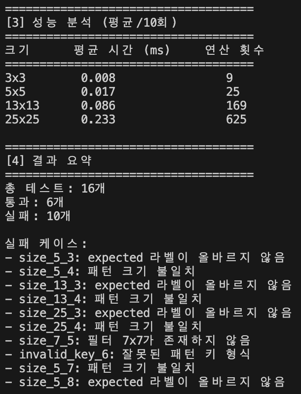
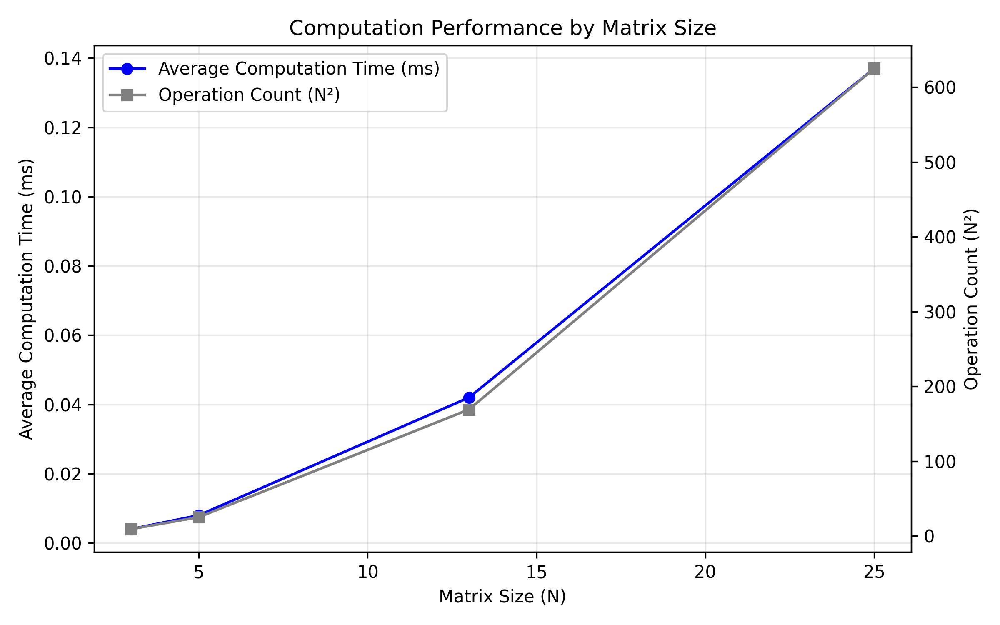

# ⚛ Mini NPU Simulator

Mini NPU Simulator는 AI 가속기(NPU)의 핵심 연산 단위인 **MAC(Multiply-Accumulate, 곱셈-누적) 연산**의 원리를 이해하고, 이차원 숫자 패턴(Cross, X)을 필터와 비교·판정하며 데이터 크기($N \times N$) 증가에 따른 시간 복잡도를 측정·분석하는 Python 시뮬레이터이다.

---

## 📌 목차

1. [프로젝트 개요](#-프로젝트-개요)
2. [주요 기능](#-주요-기능)
3. [기술 스택](#️-기술-스택)
4. [디렉터리 구조](#-디렉터리-구조)
5. [설치 및 요구사항](#️-설치-및-요구사항)
6. [실행 방법](#️-실행-방법)
7. [구현 요약](#-구현-요약)
8. [결과 리포트](#-결과-리포트)
   - [실패 원인 분석](#1-실패-원인-분석)
   - [성능 측정 및 시간 복잡도 O(N^2) 분석](#2-성능-측정-및-시간-복잡도--분석)

---

## 📖 프로젝트 개요

컴퓨터는 시각적 형상을 직접 인식하지 못하며, 2차원 숫자 배열(행렬)로 표현된 패턴을 다룬다.
입력 패턴과 필터(Filter)의 유사도를 판별하기 위해 두 배열의 동일한 위치 값을 곱하고 전체를 누적하여 합산하는 **MAC(Multiply-Accumulate) 연산**을 수행한다.

본 프로젝트는 수천~수만 번 수행되는 MAC 연산의 기초 원리를 직접 코드로 작성하고, 3x3부터 25x25 크기까지 데이터 규모에 따른 연산 시간 변화와 수치적 오차/라벨 정규화 이슈를 진단 및 검증한다.

---

## ✨ 주요 기능

1. **사용자 입력 모드 (3x3)**
   - 콘솔에서 사용자로부터 3x3 크기의 필터 A, B 및 패턴을 한 줄씩 입력받아 검증.
   - 0/1 숫자 유효성 및 행/열 개수를 검증하며 오류 시 재입력 유도.
   - 필터 A, B와의 MAC 점수 계산, 오차 범위 내 동점(판정 불가) 판정, 및 10회 평균 연산 시간 측정.

2. **JSON 데이터 분석 모드 (`data.json`)**
   - `data.json`에서 다양한 크기(5x5, 13x13, 25x25)의 필터와 패턴을 로드하여 자동 판정.
   - 키에서 크기($N$) 추출 및 필터-패턴 크기/스키마 불일치 예외 처리 (프로그램 비정상 종료 방지).
   - 라벨 정규화(`+` $\rightarrow$ `Cross`, `x` $\rightarrow$ `X`) 적용 후 예상 결과(`expected`)와 실제 판정 비교 (`PASS` / `FAIL`).
   - 테스트 결과 종합 요약(전체/통과/실패 수) 및 실패 케이스 상세 사유 출력.

3. **성능 분석 및 벤치마크**
   - I/O 시간을 제외한 MAC 연산 구간 중심 시간 측정 (기본 10회 반복 측정 후 평균산출).
   - 크기($N \times N$)별 평균 연산 시간(ms)과 총 연산 횟수($N^2$) 표 출력.

4. **테스트 데이터 생성 및 초기화**
   - `data.json` 생성 기능 (Cross, X 패턴 및 스키마 검증용 에러 케이스 포함 데이터 자동 생성).
   - `data.json` 초기화 기능.

---

## 🛠️ 기술 스택

- **언어**: Python 3.8+
- **라이브러리**: Python 표준 라이브러리 전용 (`json`, `time`, `pathlib` 등)
  - *외부 3rd-party 라이브러리(NumPy, pandas 등) 사용 금지 제약조건 준수*

---

## 📁 디렉터리 구조

```text
mini-NPU/
├── images/               # 프로그램 스크린샷, 그래프 이미지
├── main.py               # 콘솔 메뉴 인터페이스 및 프로그램 메인 루프
├── mode.py               # 모드 1(사용자 입력), 모드 2(data.json 분석) 실행 로직
├── utility.py            # MAC 연산, 라벨 정규화, 벤치마크, 검증 등 공통 유틸리티
├── pattern_generator.py  # 패턴(Cross, X) 및 test data.json 생성 모듈
├── config.py             # 설정 값 (데이터 경로, Epsilon 오차, 반복 횟수 등)
├── data.json             # 필터 및 패턴 테스트 데이터셋
└── README.md             # 프로젝트 문서 및 결과 리포트
```

---

## ⚙️ 설치 및 요구사항

- Python 3.8 이상이 설치되어 있어야 한다.
- 별도의 pip 패키지 설치가 필요하지 않다.

```bash
# Python 버전 확인
python --version

# 저장소 복제
git clone git@github.com/freepoincare/mini-NPU
cd mini-NPU
```

---

## ▶️ 실행 방법

1. 터미널(또는 명령 프롬프트)에서 프로젝트 루트 디렉터리로 이동한다.
2. `main.py`를 실행한다.

```bash
python main.py
```

3. 대화형 대시보드 메뉴에서 원하는 모드를 선택한다.
   - `1`: 사용자 입력 (3x3)
   - `2`: data.json 분석
   - `3`: data.json 생성
   - `4`: data.json 초기화
   - `0`: 종료

참고) `data.json`은 루트 디렉터리에 위치한다.


<details>
<summary>[실행 스크린샷]</summary>
<br>

> 메인 메뉴:



> 모드 1 (유저 모드):



> 모드 2 (data.json 모드):





<br>
</details>

---

## 📝 구현 요약

- **MAC 연산 구현**:
  NumPy 등의 벡터화 라이브러리 대신 이중 반복문(`for i in range(n): for j in range(n):`)을 이용하여 위치별 곱셈 및 누적합을 직접 구현.
- **라벨 정규화 (Normalization)**:
  `+`, `cross`, `Cross` 등의 입력을 내부 표준 라벨인 `Cross`로, `x`, `X` 등의 입력을 `X`로 통일한 후 판정 및 PASS/FAIL 비교를 수행.
- **점수 비교 및 동점 처리 (Epsilon)**:
  부동소수점 오차로 인한 부적절한 판정을 방지하고자 허용 오차 `EPSILON = 1e-9`를 적용하여 `abs(score_cross - score_x) < 1e-9` 일 경우 `UNDECIDED` (동점/판정 불가)로 분류.

---

## 📊 결과 리포트

### 1. 실패 원인 분석

`data.json` 분석 모드 수행 시 발생하는 FAIL 케이스와 실패가 발생하는 원인은 아래와 같이 분류할 수 있다.

#### 1.1. 데이터 및 스키마 검증 실패 (Schema / Validation Error)
- **크기 불일치 (Size Mismatch)**:
  패턴 키(예: `size_7_5`)에서 요구하는 크기와 실제 입력된 행렬 크기(5x5)가 다르거나, `[[1, 1], [1, 1]]`과 같이 $N \times N$ 구조를 갖추지 못한 경우 `FAIL`로 처리됨.
- **잘못된 키 형식 및 필수 키 누락**:
  `invalid_key_6`과 같이 패턴 크기 $N$을 추출할 수 없는 키 형식이거나, `expected` 또는 `input` 속성이 누락된 경우(예: `size_5_7`) 예외 메시지와 함께 해당 케이스만 `FAIL`로 기록하여 전체 프로그램 중단을 방지.

#### 1.2. 라벨 불일치 (Label Mismatch)
- **잘못된 expected 라벨**:
  `expected` 값에 `T`와 같이 표준 라벨(`Cross`, `X`)로 정규화할 수 없는 알 수 없는 값이 포함된 경우 `FAIL`로 판정됨.

#### 1.3. 수치 비교 및 동점 정책 (Epsilon Policy)
- **동점(UNDECIDED) 발생 시**:
  Cross 필터 점수와 X 필터 점수의 차이가 `1e-9` 미만인 경우 판정이 `UNDECIDED`가 되며, 정답 `expected`가 특정 라벨(`Cross` 또는 `X`)로 지정되어 있다면 `FAIL (동점 규칙)`으로 처리됨.

> **참고 (0 FAIL 발생 시 요약)**:
> 생성된 `data.json`이 정상적인 필터/패턴만 포함하도록 올바르게 관리되는 환경에서는, 부동소수점 오차 허용 범위(`1e-9`) 및 라벨 정규화(`+` $\rightarrow$ `Cross`, `x` $\rightarrow$ `X`) 정책이 정상 작동하여 테스트 통과율 100%(0 FAIL)를 달성함.

---

### 2. 성능 측정 및 시간 복잡도 $O(N^2)$ 분석

#### 2.1. 크기별 MAC 연산 시간 측정 결과 (10회 평균 측정 기준 예시)

| 크기 ($N \times N$) | 평균 연산 시간 (ms) | 연산 횟수 ($N^2$) |
| :---: | :---: | :---: |
| 3 × 3 | ~ 0.004 ms | 9 |
| 5 × 5 | ~ 0.008 ms | 25 |
| 13 × 13 | ~ 0.042 ms | 169 |
| 25 × 25 | ~ 0.137 ms | 625 |

참고) 평균 연산 시간은 "+" 와 "x" 연산 시간의 합으로 계산

#### 2.2. 시간 복잡도 $O(N^2)$ 근거 및 해석

1. **연산 구조적 근거**:
   $N \times N$ 2차원 배열 구조에서 필터와 패턴 간의 MAC 연산은 행(Row) $N$번, 열(Column) $N$번을 순회하는 이중 루프로 수행됨.
   따라서 총 원소 수인 $N \times N = N^2$번의 곱셈 및 가산 연산이 필수적으로 실행되므로, 이론적 시간 복잡도는 $O(N^2)$에 비례함.

2. **실측 데이터와 연산 횟수의 상관관계**:
   - $N=5$ (연산 25회) 대비 $N=13$ (연산 169회)으로 증가할 때, 연산 횟수는 약 6.76배 늘어나며 연산 시간 역시 약 5.4배~6.8배 증가하는 경향을 보임.
   - $N=5$ (연산 25회) 대비 $N=25$ (연산 625회)로 데이터 변의 길이가 5배 커질 때, 연산 횟수는 $5^2 = 25$배 증가하며 실측 연산 시간 또한 이에 비례하여 크게 증가함을 관찰할 수 있음.
   - 차수가 높아질수록 I/O overhead를 제외한 CPU 연산 시간이 $N^2$ 곡선에 수렴함을 수치적으로 검증할 수 있음.

